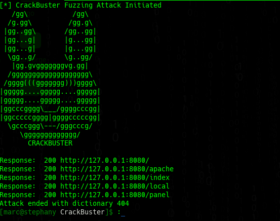

# CrackBuster version: 2.0
<center>
    <br>
</center>
* 

### web fuzzing tool programmed in Golan
#### For arch based distros and Debian distros
### For Arch based distros
```
sudo pacman -Syu
sudo pacman -S go
```
#### For debian based distros
```
sudo apt -y upgrade
sudo apt -y update
sudo apt -y install go

```
### compile, execute
```
go run setup.go --help
go build -o crackbuster setup.go 
./crackbuster -h
```
## Authors
@DigitalNinja00
